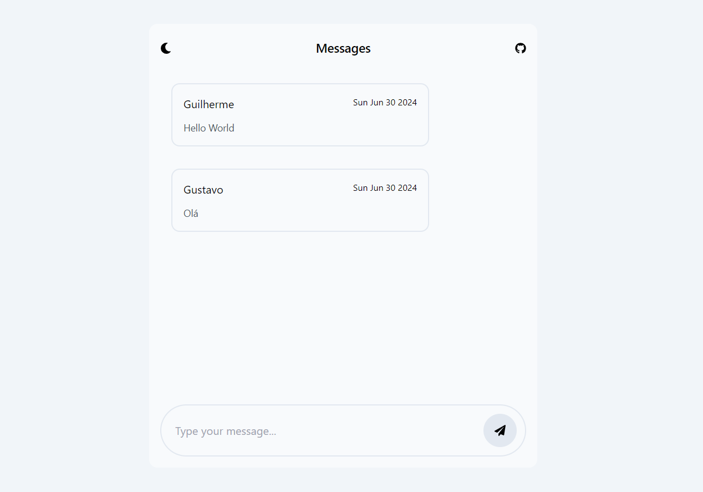

# Simple Message Board

Um simples quadro de mensagens é um aplicativo da web que permite aos usuários deixar mensagens em um quadro público. Os usuários podem postar mensagens e visualizar uma lista de todas as mensagens que foram postadas.

### Variáveis de Ambiente 
**Client**

` VITE_API_SERVER`
` VITE_API_SERVER_GET`
` VITE_API_SERVER_POST`

**Server**

`PORT`

`MONGODB_URL`

### Tecnologias 

#### Client 
- Typescript
- React
- Tailwindcss
- Vite.js

#### Server
- Typescript
- Node.js
- Express
- Mongoose
- MongoDB

[Live Demo](https://jhenriquem.github.io/simple-message-board) :point_left:

